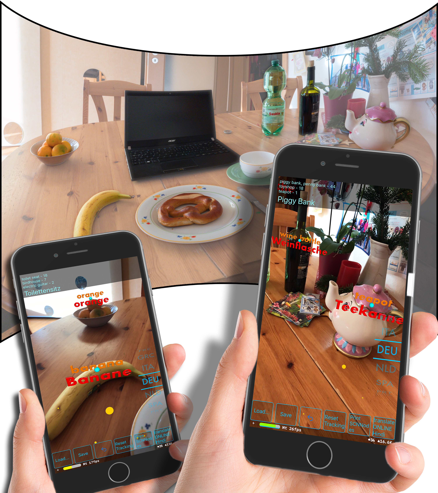

# ARTranslate - Immersive Language Exploration with Object Recognition and Augmented Reality

The use of Augmented Reality in teaching and learning contexts for language is still young. The ideas are endless, the concrete educationaloffers available emerge only gradually. Educational opportunities that were unthinkable a few years ago are now feasible.We present a concrete realization: an executable application for mobile devices with which users can explore their environment interactivelyin different languages. The software recognizes up to 1000 objects in the user’s environment using a deep learning method based onConvolutional Neural Networks (CNN) and names this objects accordingly. Using Augmented Reality (AR) the objects are superimposedwith 3D information in different languages. By switching the languages, the user is able to interactively discover his surrounding everydayitems in all languages.

Demonstration Video: https://www.youtube.com/watch?v=w_pBYrXZsjk

